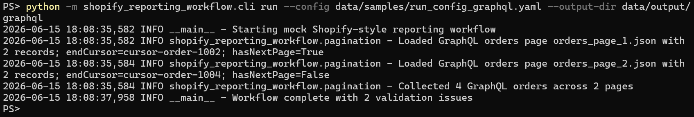

# Shopify-style API Reporting Workflow for E-commerce Data

Small e-commerce teams often need recurring order, customer, and product reports from Shopify-style API data. The hard part is usually not building a full data warehouse. The practical problem is making API exports repeatable, validated, mapped into reporting-friendly tables, exported to CSV, Excel, or SQLite-style deliverables, and easy to hand off.

This repository is a **public case-study repository**. It contains sanitized documentation, small output previews, and screenshots. The runnable implementation is intentionally kept private as a reusable commercial delivery asset.

> For a fully runnable open-source data workflow project, see `data-quality-etl-starter`. This repository focuses on a vertical e-commerce API reporting scenario.

## What problem this solves

Many small-store reporting problems are not "big data" problems. They are repeatability, validation, mapping, and handoff problems.

Typical issues include:

* orders exported manually from an admin screen every week;
* inconsistent product, customer, fulfillment, tax, discount, or product fields across reports;
* nested API responses that are difficult to use in spreadsheets;
* missing emails, fulfillment statuses, product details, or reporting fields;
* recurring reports that depend on one person's manual cleanup steps;
* clients who need CSV or Excel deliverables, not a full warehouse build;
* store-specific reporting logic that needs to be documented before automation.

This case study demonstrates how that type of work can be structured as a repeatable API-to-reporting workflow.

## Who this is for

This case study is aimed at:

* small e-commerce teams that need recurring operational reports;
* founders and store operators who need cleaner order, customer, and product exports;
* agencies supporting Shopify-style reporting requests for clients;
* teams that want spreadsheet or lightweight database outputs before investing in BI infrastructure;
* clients looking for API-to-CSV, API-to-Excel, or reporting automation support.

## Typical client scenarios

* "I need a weekly Shopify order report with customer and product details."
* "I want sales grouped by product and month, delivered as Excel."
* "My exported order data has missing values and inconsistent fields."
* "I need a repeatable workflow that someone else on my team can run."
* "I want a small reporting database or spreadsheet output before considering a BI tool."
* "I need a safe process for turning API-style order data into report-ready tables."

## What this workflow demonstrates

The private implementation behind this case study demonstrates a practical reporting workflow:

* extract Shopify-style order, customer, and product data from sanitized API-shaped inputs;
* handle paginated order-style responses in a repeatable way;
* normalize nested objects into reporting-friendly tables;
* expand order line items into their own reporting table;
* validate required fields and surface data quality warnings;
* create cleaned order, customer, product, and line-item outputs;
* generate summary tables for month, product, and customer reporting;
* export deliverables suitable for CSV, Excel workbook, Markdown report, and SQLite-style handoff;
* document which parts are generic workflow design and which parts must be adapted per store;
* keep public evidence, security boundaries, and optional delivery extensions separate from private implementation assets.

## Example workflow

```text
Shopify-style API responses
    -> extract paginated order, customer, and product records
    -> normalize nested JSON into reporting tables
    -> validate required business fields
    -> map store-specific fields into reporting columns
    -> export cleaned CSV, Excel-style, and SQLite-style deliverables
    -> generate a short handoff report with validation notes
```

## Sample outputs

This repository includes small sanitized previews only:

* [report_preview.md](sample_outputs/report_preview.md)
* [report_preview_graphql.md](sample_outputs/report_preview_graphql.md)
* [orders_cleaned_preview.csv](sample_outputs/orders_cleaned_preview.csv)
* [customer_order_summary_preview.csv](sample_outputs/customer_order_summary_preview.csv)
* [sales_summary_by_month_preview.csv](sample_outputs/sales_summary_by_month_preview.csv)
* [sales_summary_by_product_preview.csv](sample_outputs/sales_summary_by_product_preview.csv)

These files show the shape of the deliverables without including complete mock data, private implementation details, real client data, access tokens, store domains, or production connector code.

## v0.2 GraphQL-shaped mock workflow

v0.2 adds a private GraphQL-shaped mock workflow to the case study. It uses fake local fixtures only and simulates GraphQL-style connection pagination with `edges`, `node`, `cursor`, and `pageInfo` shapes.

This better reflects Shopify's current GraphQL Admin API direction than a simple REST-style mock export. The public repo documents the workflow shape and includes a sanitized report preview, but it does not include GraphQL query templates, OAuth, tokens, real store domains, client data, or production connector code.

Useful public notes:

* [docs/graphql_workflow_summary.md](docs/graphql_workflow_summary.md)
* [docs/rest_to_graphql_mock_migration_summary.md](docs/rest_to_graphql_mock_migration_summary.md)

## Later private milestone summaries

The public docs also include sanitized summaries for later private planning and boundary work:

* [docs/development_store_validation_summary.md](docs/development_store_validation_summary.md) - v0.3 development-store validation guidance and evidence boundary notes.
* [docs/v0_3_evidence_boundary_summary.md](docs/v0_3_evidence_boundary_summary.md) - public-safe evidence rules for screenshots, previews, and workflow notes.
* [docs/private_connector_template_summary.md](docs/private_connector_template_summary.md) - v0.4 private connector template summary at a high level only.
* [docs/v0_4_security_boundary_summary.md](docs/v0_4_security_boundary_summary.md) - public/private security boundary notes for connector work.
* [docs/client_delivery_workflow_summary.md](docs/client_delivery_workflow_summary.md) - v0.5 delivery workflow planning summary.
* [docs/optional_extensions_planning_summary.md](docs/optional_extensions_planning_summary.md) - optional Google Sheets or PostgreSQL delivery planning notes.

These docs are intentionally concise public summaries. Implementation details, full fixtures, GraphQL queries, connector templates, credentials, live validation evidence, and client-specific materials remain private.

## Screenshots

The screenshots below are evidence from the private runnable workflow and the sanitized public preview files. They are included to show workflow behavior and output shape, not to expose the implementation.

### CLI workflow run


This shows a local mock API workflow completing pagination, extraction, validation, and report generation.

### Test evidence


This shows automated tests passing for the v0.1 private workflow implementation.

### Sanitized public output previews


This shows the public-safe preview files included in this repository.

### Excel workbook preview


This shows an Excel-style reporting workbook with order, line-item, product, customer, and summary sheets.

### Markdown report preview


This shows a generated report preview with run summary, extraction summary, output files, validation issues, and limitations.

### SQLite table preview


This shows a lightweight SQLite-style handoff with normalized reporting tables and summary tables.

### GraphQL-shaped mock workflow



This shows the v0.2 private workflow completing against fake GraphQL-shaped local fixtures with cursor-style pagination. It is evidence of the case-study workflow shape, not a production Shopify connector.

See [screenshots/README.md](screenshots/README.md) for screenshot notes and safety rules.

## Public and private boundary

Public repository includes:

* README and case-study documentation;
* sanitized sample output previews;
* screenshots and screenshot notes;
* high-level workflow and implementation-boundary explanations.

Private implementation includes:

* runnable extraction, validation, transformation, and export code;
* local mock fixtures used for development;
* private development-store validation notes and gated connector template planning;
* store-specific field mapping work;
* any client-specific adaptations;
* any credentials, access tokens, scopes, domains, or API configuration.

The public repo intentionally does **not** include `src/`, `tests/`, `scripts/`, query folders, dependency files, Docker files, credentials, full mock data, private paths, or production connector code.

See [docs/implementation_boundary.md](docs/implementation_boundary.md) for the full boundary.

## Repository contents

```text
README.md
NOTICE.md
docs/
sample_outputs/
screenshots/
```

Key docs:

* [docs/case_study.md](docs/case_study.md)
* [docs/architecture_overview.md](docs/architecture_overview.md)
* [docs/workflow_overview.md](docs/workflow_overview.md)
* [docs/graphql_workflow_summary.md](docs/graphql_workflow_summary.md)
* [docs/rest_to_graphql_mock_migration_summary.md](docs/rest_to_graphql_mock_migration_summary.md)
* [docs/development_store_validation_summary.md](docs/development_store_validation_summary.md)
* [docs/v0_3_evidence_boundary_summary.md](docs/v0_3_evidence_boundary_summary.md)
* [docs/private_connector_template_summary.md](docs/private_connector_template_summary.md)
* [docs/v0_4_security_boundary_summary.md](docs/v0_4_security_boundary_summary.md)
* [docs/client_delivery_workflow_summary.md](docs/client_delivery_workflow_summary.md)
* [docs/optional_extensions_planning_summary.md](docs/optional_extensions_planning_summary.md)
* [docs/output_examples.md](docs/output_examples.md)
* [docs/client_work_mapping.md](docs/client_work_mapping.md)
* [docs/implementation_boundary.md](docs/implementation_boundary.md)
* [docs/limitations.md](docs/limitations.md)

## Relationship to `data-quality-etl-starter`

This case study is related to `data-quality-etl-starter`, but it is not the same kind of repository.

`data-quality-etl-starter` is a runnable starter showing general data quality ETL patterns for CSV, Excel, JSON, and API-style data. This repository is a public case study focused on a Shopify-style e-commerce reporting use case.

The shared idea is the same: small teams often need practical, repeatable, validated data workflows before they need heavyweight data infrastructure. This project narrows that idea to e-commerce reporting deliverables.

## Shopify API reality and GraphQL migration path

A real Shopify implementation would need to be adapted to the current Shopify Admin API requirements for each store.

Important production considerations include:

* Shopify GraphQL Admin API usage instead of assuming a simple REST export;
* app authentication and access scopes approved for the required resources;
* cursor-based pagination for orders, customers, products, and related objects;
* rate limits and retry behavior;
* store-specific field mapping for products, variants, discounts, taxes, locations, channels, fulfillments, refunds, and custom attributes;
* privacy-aware handling of customer data;
* documented assumptions for reporting metrics such as gross sales, net sales, tax, shipping, refunds, and discounts.

The public case study describes the reporting workflow pattern. It does not claim to be a drop-in Shopify app or production connector.

## Limitations

This repository is intentionally not:

* a runnable implementation;
* a Shopify app;
* a production Shopify connector;
* public development-store validation evidence;
* a public connector template;
* a Google Sheets or PostgreSQL integration;
* a complete data warehouse;
* a dbt, Airflow, Snowflake, Databricks, or BigQuery project;
* a BI dashboard product;
* a complete field mapping template;
* a source of real Shopify data, credentials, or store configuration.

See [docs/limitations.md](docs/limitations.md) for more detail.

## How to use this case study

Use this repository to understand the workflow shape and output expectations for a small e-commerce reporting automation project.

For an actual client project, the implementation would need to confirm:

* target Shopify data objects;
* required access scopes;
* report definitions and business metric rules;
* output format requirements;
* schedule or delivery cadence;
* privacy and retention requirements;
* store-specific field mapping.
